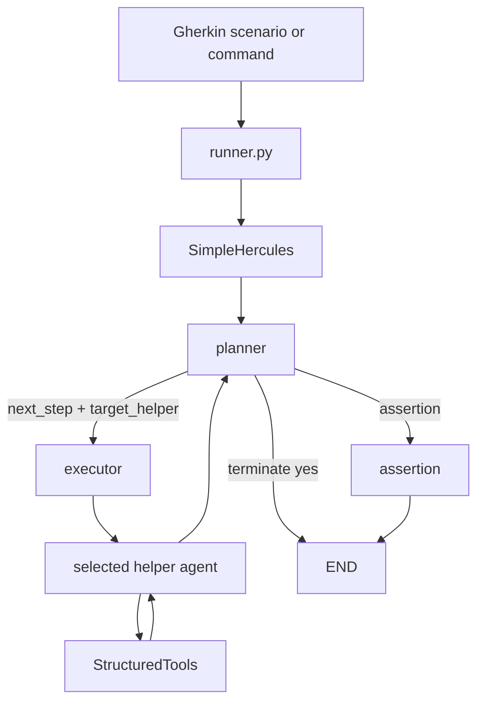

# Hercules Architecture

This document describes the current Hercules runtime architecture and public
tool/input formats.

## Runtime Overview

Hercules runs Gherkin scenarios through `SimpleHercules`, a LangGraph state
graph. The graph has three nodes:

- `planner`
- `executor`
- `assertion`

The high-level flow is:



The public interface is still feature files in and test artifacts out, but the
runtime is now an explicit graph rather than a conversational group-chat loop.

## Planner Response Format

The planner returns strict JSON. Current examples should use fields like:

```json
{
  "plan": "Open Salesforce and create an account.",
  "next_step": "Navigate to Accounts and click New.",
  "target_helper": "browser",
  "terminate": "no",
  "is_assert": false,
  "assert_summary": "",
  "is_passed": null
}
```

`terminate` remains `"no"` while work remains. `target_helper` controls which
helper executes the next step.

## Helper Routing

| Planner `target_helper` | Runtime helper |
| --- | --- |
| `browser` | `browser_nav_agent` |
| `api` | `api_nav_agent` |
| `sec` | `sec_nav_agent` |
| `sql` | `sql_nav_agent` |
| `time_keeper` | `time_keeper_nav_agent` |
| `mcp` | `mcp_nav_agent` |
| `executor` | `executor_nav_agent` |
| `agent` | `browser_nav_agent` |

Navigation helpers expose an LLM, a system message, an agent name, and a list
of LangChain `StructuredTool` objects.

## Tool Registration and Execution

Tools are normal Python functions registered with the local `@tool(...)`
decorator. Registration flows through:


`SimpleHercules._run_nav_agent()` runs the bounded helper loop: invoke the
helper LLM, execute returned tool calls, append tool results, and continue
until the helper completes or reaches the configured round limit.

## Tool Schema Rules

Tool schemas should stay compatible with strict OpenAI-compatible and
Vertex/Gemini-style providers.

Use:

- scalar parameters such as `str`, `int`, `float`, and `bool`
- `List[Dict[str, str]]` for bulk browser actions
- explicit empty schemas for no-argument tools

Avoid:

- tuple public inputs
- generated `prefixItems`
- malformed list schemas such as `items: {}`
- wrapper-only top-level `kwargs`
- stale browser argument names such as `selector_text_list`

## Browser Tool Examples

Single click:

```json
{
  "selector": "button[md='new-account']",
  "type_of_click": "click"
}
```

Bulk text entry:

```json
{
  "entries": [
    {
      "selector": "input[md='account-name']",
      "text_to_enter": "Acme"
    }
  ]
}
```

Bulk select:

```json
{
  "entries": [
    {
      "selector": "select[md='industry']",
      "value_to_select": "Technology"
    }
  ]
}
```

Bulk date/time or slider tools use `value_to_set`:

```json
{
  "entries": [
    {
      "selector": "input[md='close-date']",
      "value_to_set": "2026-06-18"
    }
  ]
}
```

## DOM Format

Hercules injects an `md` attribute into DOM elements and uses it as the primary
selector reference.

Current sensing tools return compact payloads:

- `get_interactive_elements`: interactive accessibility nodes
- `get_input_fields`: form/input nodes
- `get_page_text`: cleaned visible text
- `geturl`: current page URL

Do not document full raw DOM dumps as the default output. Large or deeply
nested DOM payloads can cause provider-side `INVALID_ARGUMENT` or token-limit
errors on complex pages.

## LLM Config Buckets

`agents_llm_config.json` profiles use these buckets:

```json
{
  "planner_agent": {},
  "nav_agent": {},
  "mem_agent": {},
  "helper_agent": {}
}
```

- `planner_agent`: planner node model
- `nav_agent`: shared by browser, API, security, SQL, time keeper, MCP, and
  executor helpers
- `mem_agent`: dynamic long-term memory model
- `helper_agent`: visual/multimodal helper model

The planner model should be strong at structured JSON. Navigation models must
support tool calling.
