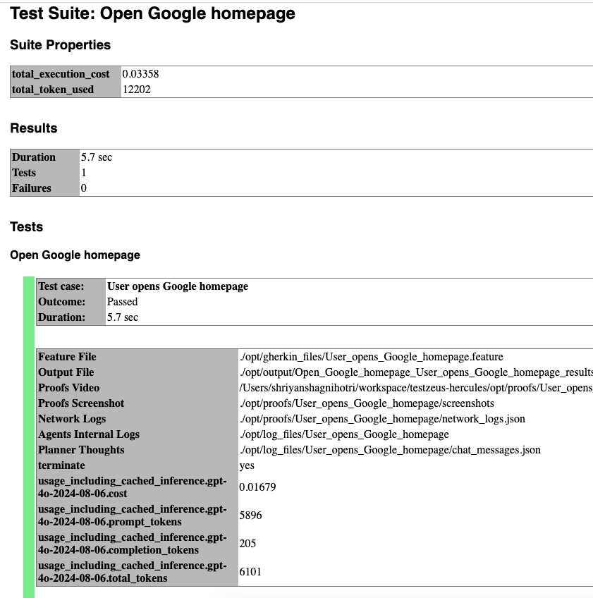
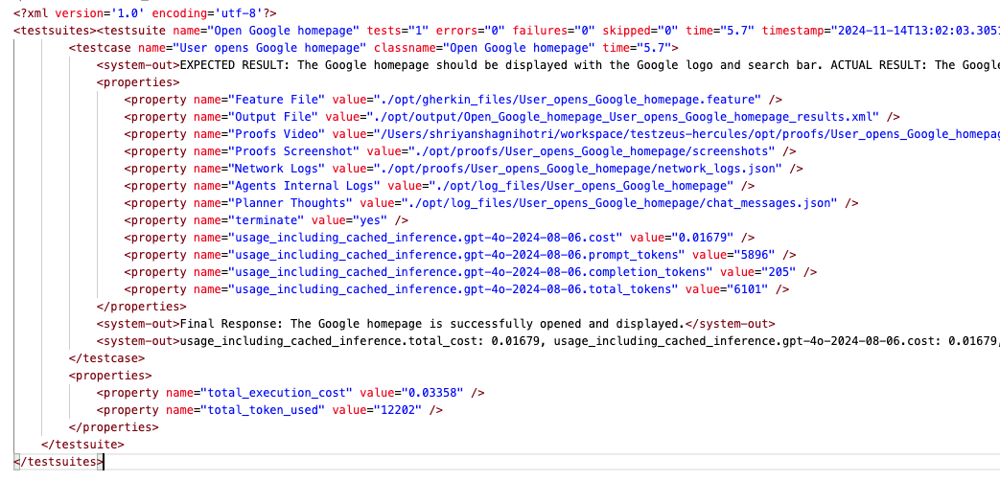
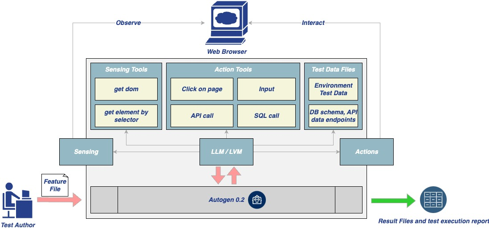

# 💪 Hercules

[](https://github.com/test-zeus-ai/testzeus-hercules/actions/workflows/main-test.yml)

Testing modern web applications can be difficult, with frequent changes and complex features making it hard to keep up. That’s where **Hercules** comes in. Hercules is the world’s first open-source testing agent, built to handle the toughest testing tasks so you don’t have to. It turns simple, easy-to-write Gherkin steps into fully automated **end to end** tests—no coding skills needed. Whether you’re working with tricky platforms like Salesforce or running tests in your CI/CD pipeline, Hercules adapts to your needs and takes care of the details. With Hercules, testing becomes simple, reliable, and efficient, helping teams everywhere deliver better software.

Using Hercules is as simple as feeding in your Gherkin features, and getting the results:


At [TestZeus](www.testzeus.com), we believe that **trustworthy and open-source code** is the backbone of innovation. That's why we've built Hercules to be transparent, reliable, and community-driven.

Our mission? To **democratize and disrupt test automation**, making top-tier testing accessible to everyone, not just the elite few. No more gatekeeping—everyone deserves a hero on their testing team!

### Video Tutorials: [@TestZeus](https://www.youtube.com/@TestZeus)
---

#### 🚀 **Getting Started with TestZeus Hercules**
- **Introduction to TestZeus Hercules**  
  Learn about the core features of TestZeus Hercules and how it can streamline end-to-end testing for your projects.  
  _[Watch now](https://youtu.be/_m_NDjM6aZ0?si=ArtVKz8uSgGWTcAK)_

- **Installation and Setup Guide**  
  Step-by-step instructions for installing and configuring TestZeus Hercules in your environment.  
  _[Watch now](https://youtu.be/9D-SZGoDrfc?si=GL0IArWkB1ZgBdx5)_

---

#### 🧪 **Writing and Executing Test Cases**
- **Creating BDD Test Cases**  
  Learn how to write Behavior-Driven Development (BDD) test cases for Hercules and use dynamic testdata.  
  _[Watch now](https://www.youtube.com/watch?v=yJD0cZ7Bx6Q&t)_

---

#### 🌐 **Integrations and Advanced Features**
- **Testing Multilingual content**  
  Learn how Hercules interacts with web browsers to perform Testing on Multilingual content via Multilingual testcase.  
  _[Watch now](https://youtu.be/vI9iGSqKpGA?si=6NGAvKnwFboSyHT2)_
---

#### 🛠️ **Customization and Community Tools**
- **Enhancing Hercules with Community-Driven Tools**  
  Discover how to customize Hercules and incorporate additional tools provided by the community.  
  _[Watch now](https://youtu.be/C8hUy5leRF0?si=yVMpZ7WFcI01BoI3)_
---

#### 🛠️ **API Testing**
- **API testing all the way, new ways to do end to end**  
  _[Watch now](https://youtu.be/qMt89DQH6LQ?si=lcSJbKOCaqqUGeQ8)_
---

#### 🛠️ **Security Testing**
- **Security Testing done end to end**  
  _[Watch now](https://youtu.be/o6MmfTakIh4?si=JL8iu4e3i85SWrxU)_

---

## ⚙️ Installation and Usage

Hercules offers multiple ways to get started, catering to different user preferences and requirements.


For a quick taste of the solution, you can try the notebook here: 
[](https://colab.research.google.com/drive/1YiZsXem1POTwkcr17QqflXnihhuSqwM2?usp=sharing)
- **Note**: Colab might ask you to restart the session as python3.11 and some libs are installed during the installation of testzeus-hercules. Please restart the session if required and continue the execution. Also , we recommend one of the approaches below for getting the full flavor of the solution. 

### Approach 1: Using PyPI Package

#### Installation

Install Hercules from PyPI:

```bash
pip install testzeus-hercules
```

Hercules uses Playwright to interact with web pages, so you need to install Playwright and its dependencies:

```bash
playwright install --with-deps
```

#### Basic Parameters

Once installed, you will need to provide some basic parameters to run Hercules:

- `--input-file INPUT_FILE`: Path to the input Gherkin feature file to be tested.
- `--output-path OUTPUT_PATH`: Path to the output directory. The path of JUnit XML result and HTML report for the test run.
- `--test-data-path TEST_DATA_PATH`: Path to the test data directory. The path where Hercules expects test data to be present; all test data used in feature testing should be present here.
- `--project-base PROJECT_BASE`: Path to the project base directory. This is an optional parameter; if you populate this, `--input-file`, `--output-path`, and `--test-data-path` are not required, and Hercules will assume all the three folders exist in the following format inside the project base:

```
PROJECT_BASE/
├── gherkin_files/
├── input/
│   └── test.feature
├── log_files/
├── output/
│   ├── test.feature_result.html
│   └── test.feature_result.xml
├── proofs/
│   └── User_opens_Google_homepage/
│       ├── network_logs.json
│       ├── screenshots/
│       └── videos/
└── test_data/
    └── test_data.txt
```

- `--llm-model LLM_MODEL`: Name of the LLM model to be used by the agent (recommended is `gpt-4o`, but it can take others).
- `--llm-model-api-key LLM_MODEL_API_KEY`: API key for the LLM model, something like `sk-proj-k.......`.


#### Running Hercules

After passing all the required parameters, the command to run Hercules should look like this:

```bash
testzeus-hercules --input-file opt/input/test.feature --output-path opt/output --test-data-path opt/test_data --llm-model gpt-4o --llm-model-api-key sk-proj-k.......
```


#### Supported AI Models for TestZeus-Hercules
- Anthropic Haiku: Compatible with Haiku 3.5 and above.
- Groq: Supports any version with function calling and coding capabilities.
- Mistral: Supports any version with function calling and coding capabilities.
- OpenAI: Fully compatible with GPT-4o and above. Note: OpenAI GPT-4o-mini is not supported.
- Ollama: Not supported based on current testing.

#### Execution Flow

Upon running the command:

- Hercules will start and attempt to open a web browser (default is Chromium).
- It will prepare a plan of execution based on the feature file steps provided.
- The plan internally expands the brief steps mentioned in the feature file into a more elaborated version.
- Hercules detects assertions in the feature file and plans the validation of expected results with the execution happening during the test run.
- All the steps, once elaborated, are passed to different tools based on the type of execution requirement of the step. For example, if a step wants to click on a button and capture the feedback, it will be passed to the `click_using_selector` tool.

#### Output and Logs

Once the execution is completed:

- Logs explaining the sequence of events are generated.
- The best place to start is the `output-path`, which will have the JUnit XML result file as well as an HTML report regarding the test case execution.
- You can also find proofs of execution such as video recordings, screenshots per event, and network logs in the `proofs` folder.
- To delve deeper and understand the chain of thoughts, refer to the `chat_messages.json` in the `log_files`. This will have exact steps that were planned by the agent.

#### Sample Feature File

Here's a sample feature file:

```gherkin
Feature: Account Creation in Salesforce

 Scenario: Successfully create a new account

   Given I am on the Salesforce login page
   When I enter my username "user@example.com" and password "securePassword"
   And I click on the "Log In" button
   And I navigate to the "Accounts" tab
   And I click on the "New" button
   And I fill in the "Account Name" field with "Test Account"
   And I select the "Account Type" as "Customer"
   And I fill in the "Website" field with "www.testaccount.com"
   And I fill in the "Phone" field with "123-456-7890"
   And I click on the "Save" button
   Then I should see a confirmation message "Account Test Account created successfully"
   And I should see "Test Account" listed in the account records
```

#### Sample Result Screenshot

##### Sample HTML Result Screenshot

##### Sample XML Result Screenshot


---

### Approach 2: Using Docker

For all the scale lovers, Hercules is also available as a Docker image.

#### Pull the Docker Image

```bash
docker pull testzeus/hercules:latest
```

#### Running Hercules in Docker

Run the container using:

```bash
docker run --env-file=.env \
  -v ./agents_llm_config.json:/testzeus-hercules/agents_llm_config.json \
  -v ./opt:/testzeus-hercules/opt \
  --rm -it testzeus/hercules:latest
```

- **Environment Variables**: All the required environment variables can be set by passing an `.env` file to the `docker run` command.
- **LLM Configuration**: If you plan to have complete control over Hercules and which LLM to use beyond the ones provided by OpenAI, you can pass `agents_llm_config.json` as a mount to the container. This is for advanced use cases and is not required for beginners. Refer to sample files `.env-example` and `agents_llm_config-example.json` for details and reference.
- **Mounting Directories**: Mount the `opt` folder to the Docker container so that all the inputs can be passed to Hercules running inside the container, and the output can be pulled out for further processing. The repository has a sample `opt` folder that can be mounted easily.
- **Simplified Parameters**: In the Docker case, there is no need for using `--input-file`, `--output-path`, `--test-data-path`, or `--project-base` as they are already handled by mounting the `opt` folder in the `docker run` command.

#### Browser Access in Docker

- While running in Docker mode, understand that Hercules has access only to a headless web browser.
- If you want Hercules to connect to a visible web browser, try the CDP URL option in the environment file. This option can help you connect Hercules running in your infrastructure to a remote browser like BrowserBase or your self-hosted grid.
- Use `CDP_ENDPOINT_URL` to set the CDP URL of the Chrome instance that has to be connected to the agent.

#### Output and Logs

After the command completion:

- The container terminates, and output is written in the mounted `opt` folder, in the same way as described in the directory structure.
- You will find the JUnit XML result file, HTML reports, proofs of execution, and logs in the respective folders.

---

### Approach 3: Building and running from Source Code

For the hardcore enthusiasts, you can use Hercules via the source code to get a complete experience of customization and extending Hercules with more tools.

#### Prerequisites

- Ensure you have **Python 3.11** installed on your system.

#### Steps to Run from Source

1. **Clone the Repository**

   ```bash
   git clone git@github.com:test-zeus-ai/testzeus-hercules.git
   ```

2. **Navigate to the Directory**

   ```bash
   cd testzeus-hercules
   ```

3. **Use Make Commands**

   The repository provides handy `make` commands.

   - Use `make help` to check out possible options.

4. **Install Poetry**

   ```bash
   make setup-poetry
   ```

5. **Install Dependencies**

   ```bash
   make install
   ```

6. **Run Hercules**

   ```bash
   make run
   ```

   - This command reads the relevant feature files from the `opt` folder and executes them, putting the output in the same folder.
   - The `opt` folder has the following format:

     ```
     opt/
     ├── input/
     │   └── test.feature
     ├── output/
     │   ├── test.feature_result.html
     │   └── test.feature_result.xml
     ├── log_files/
     ├── proofs/
     │   └── User_opens_Google_homepage/
     │       ├── network_logs.json
     │       ├── screenshots/
     │       └── videos/
     └── test_data/
         └── test_data.txt
     ```

7. **Interactive Mode**

   You can also run Hercules in interactive mode as an instruction execution agent, which is more useful for RPA and debugging test cases and Hercules's behavior on new environments while building new tooling and extending the agents.

   ```bash
   make run-interactive
   ```

   - This will trigger an input prompt where you can chat with Hercules, and it will perform actions based on your commands.

---

## 📝 Configuration Details

### Disabling Telemetry

To disable telemetry, set the `TELEMETRY_ENABLED` environment variable to `0`:

```bash
export TELEMETRY_ENABLED=0
```

### Auto Mode

If `AUTO_MODE` is set to `1`, Hercules will not request an email during the run:

```bash
export AUTO_MODE=1
```

### Understanding the Environment File (`.env`)

To configure Hercules in detail:

- Copy the base environment file:

  ```bash
  cp .env-example .env
  ```

- Hercules is capable of running in two configuration forms:

  1. **Using single LLM for all work**

     - For all the activities within the agent, initialize `LLM_MODEL_NAME` and `LLM_MODEL_API_KEY`.
     - If using a non-OpenAI hosted solution but still OpenAI LLMs (something like OpenAI via Groq), then pass the `LLM_MODEL_BASE_URL` URL as well.

  2. **Custom LLMs for different work or using hosted LLMs**

     - If you plan to configure local LLMs or non-OpenAI LLMs, use the other parameters like `AGENTS_LLM_CONFIG_FILE` and `AGENTS_LLM_CONFIG_FILE_REF_KEY`.
     - These are powerful options and can affect the quality of Hercules outputs.

- Hercules considers a base folder that is by default `./opt` but can be changed by the environment variable `PROJECT_SOURCE_ROOT`.

- **Connecting to an Existing Chrome Instance**

  - This is extremely useful when you are running Hercules in Docker for scale.
  - You can connect Hercules running in your infrastructure to a remote browser like BrowserBase or your self-hosted grid.
  - Use `CDP_ENDPOINT_URL` to set the CDP URL of the Chrome instance that has to be connected to the agent.

- **Controlling Other Behaviors**

  You can control other behaviors of Hercules based on the following environment variables:

  - `HEADLESS=true`
  - `RECORD_VIDEO=false`
  - `TAKE_SCREENSHOTS=false`
  - `BROWSER_TYPE=chromium` (options: `firefox`, `chromium`)
  - `CAPTURE_NETWORK=false`
 
For example: If you would like to run with a "Headful" browser, you can set the environment variable with ```export HEADLESS=false``` before triggering Hercules.


### Understanding `agents_llm_config-example.json`

- It's a list of configurations of LLMs that you want to provide to the agent.

- Example:

  ```json
  {
    "mistral-large-agente": {
      "planner_agent": {
        "model_name": "mistral",
        "model_api_key": "",
        "model_base_url": "https://...",
        "system_prompt": "You are a web automation task planner....",
        "llm_config_params": {
          "cache_seed": null,
          "temperature": 0.1,
          "top_p": 0.1
        }
      },
      "browser_nav_agent": {
        "model_name": "mistral",
        "model_api_key": "",
        "model_base_url": "https://...",
        "system_prompt": "You will perform web navigation tasks with the functions that you have...\nOnce a task is completed, confirm completion with ##TERMINATE TASK##.",
        "llm_config_params": {
          "cache_seed": null,
          "temperature": 0.1,
          "top_p": 0.1
        }
      }
    }
  }
  ```

- The key is the name of the spec that is passed in `AGENTS_LLM_CONFIG_FILE_REF_KEY`, whereas the Hercules information is passed in sub-dicts `planner_agent` and `browser_nav_agent`.

- **Note**: This option should be ignored until you are sure what you are doing. Discuss with us while playing around with these options in our Slack communication. Join us at our [Slack](https://join.slack.com/t/testzeuscommunityhq/shared_invite/zt-2v2br8wog-FAmo_76xRHx~k~1oNaGQ0Q)

---


## ⚡️ Features

Hercules is production ready, and packs a punch with features:

### Gherkin In, Results Out

Hercules makes testing as simple as Gherkin in, results out. Just feed your end-to-end tests in Gherkin format, and watch Hercules spring into action. It takes care of the heavy lifting by running your tests automatically and presenting results in a neat JUnit format. No manual steps, no fuss—just efficient, seamless testing.

### Free and Open Source

With Hercules, you're harnessing the power of open source with zero licensing fees. Feel free to dive into the code, contribute, or customize it to your heart's content. Hercules is as free as it is mighty, giving you the flexibility and control you need.

### Salesforce Ready

Built to handle the most intricate UIs, Hercules conquers Salesforce and other complex platforms with ease. Whether it's complicated DOM or running your SOQL or Apex, Hercules is ready and configurable.

### No Code Required

Say goodbye to complex scripts and elusive locators. Hercules is here to make your life easier with its no-code approach, taking care of the automation of Gherkin features so you can focus on what matters most—building quality software.

### Multilingual

With multilingual support right out of the box, Hercules is ready to work with teams across the globe. Built to bridge language gaps, it empowers diverse teams to collaborate effortlessly on a unified testing platform.

### Precisely Accurate

Hercules records video of the execution, and captures network logs as well, so that you dont have to deal with "It works on my computer".


### No Maintenance

Autonomous and adaptive, Hercules takes care of itself with auto-healing capabilities. Forget about tedious maintenance—Hercules adjusts to changes and stays focused on achieving your testing goals.

### UI Assertions

Grounded in the powerful foundations of TestZeus, Hercules tackles UI assertions with unwavering focus, ensuring that no assertion goes unchecked and no bug goes unnoticed. It's thorough, it's sharp, and it's ready for action.

### CI/CD Ready

Run Hercules locally or integrate it seamlessly into your CI/CD pipeline. Docker-native and one-command ready, Hercules fits smoothly into your deployment workflows, keeping testing quick, consistent, and hassle-free.

With Hercules, testing is no longer just a step in the process—it's a powerful, streamlined experience that brings quality to the forefront.

---


## 🦾 Architecture

### Multi-Agentic Solution

Hercules leverages a multi-agent architecture based on the AutoGen framework. Building on the foundation provided by the AutoGen framework, Hercules's architecture leverages the interplay between tools and agents. Each tool embodies an atomic action, a fundamental building block that, when executed, returns a natural language description of its outcome. This granularity allows Hercules to flexibly assemble these tools to tackle complex web automation workflows.

#### System View



The diagram above shows the configuration chosen on top of AutoGen architecture. The tools can be partitioned differently, but this is the one that we chose for the time being. We chose to use tools that map to what humans learn about the web browser rather than allow the LLM to write code as it pleases. We see the use of configured tools to be safer and more predictable in its outcomes. Certainly, it can click on the wrong things, but at least it is not going to execute malicious unknown code.


#### Agents

At the moment, there are two agents:

1. **Planner Agent**: Executes the planning and decomposition of tasks.
2. **Browser Navigation Agent**: Embodies all the tools for interacting with the web browser.

#### Tools Library

At the core of Hercules's capabilities is the Tools Library, a repository of well-defined actions that Hercules can perform; for now, web actions. These tools are grouped into two main categories:

- **Sensing Tools**: Tools like `get_dom_with_content_type` and `geturl` that help Hercules understand the current state of the webpage or the browser.
- **Action Tools**: Tools that allow Hercules to interact with and manipulate the web environment, such as `click`, `enter_text`, and `openurl`.

Each tool is created with the intention to be as conversational as possible, making the interactions with LLMs more intuitive and error-tolerant. For instance, rather than simply returning a boolean value, a tool might explain in natural language what happened during its execution, enabling the LLM to better understand the context and correct course if necessary.

##### Implemented Tools

- **Sensing Tools**

  - `geturl`: Fetches and returns the current URL.
  - `get_dom_with_content_type`: Retrieves the HTML DOM of the active page based on the specified content type.
    - `text_only`: Extracts the inner text of the HTML DOM. Responds with text output.
    - `input_fields`: Extracts the interactive elements in the DOM (button, input, textarea, etc.) and responds with a compact JSON object.
    - `all_fields`: Extracts all the fields in the DOM and responds with a compact JSON object.
  - `get_user_input`: Provides the orchestrator with a mechanism to receive user feedback to disambiguate or seek clarity on fulfilling their request.

- **Action Tools**

  - `click`: Given a DOM query selector, this will click on it.
  - `enter_text`: Enters text in a field specified by the provided DOM query selector.
  - `enter_text_and_click`: Optimized method that combines `enter_text` and `click` tools.
  - `bulk_enter_text`: Optimized method that wraps `enter_text` method so that multiple text entries can be performed in one shot.
  - `openurl`: Opens the given URL in the current or new tab.

#### DOM Distillation

Hercules's approach to managing the vast landscape of HTML DOM is methodical and essential for efficiency. We've introduced **DOM Distillation** to pare down the DOM to just the elements pertinent to the user's task.

In practice, this means taking the expansive DOM and delivering a more digestible JSON snapshot. This isn't about just reducing size; it's about honing in on relevance, serving the LLMs only what's necessary to fulfill a request. So far, we have three content types:

1. **Text Only**: For when the mission is information retrieval, and the text is the target. No distractions.
2. **Input Fields**: Zeroing in on elements that call for user interaction. It's about streamlining actions.
3. **All Content**: The full scope of distilled DOM, encompassing all elements when the task demands a comprehensive understanding.

It's a surgical procedure, carefully removing extraneous information while preserving the structure and content needed for the agent's operation. Of course, with any distillation, there could be casualties, but the idea is to refine this over time to limit/eliminate them.

Since we can't rely on all web page authors to use best practices, such as adding unique IDs to each HTML element, we had to inject our own attribute (`mmid`) in every DOM element. We can then guide the LLM to rely on using `mmid` in the generated DOM queries.

To cut down on some of the DOM noise, we use the **DOM Accessibility Tree** rather than the regular HTML DOM. The accessibility tree, by nature, is geared towards helping screen readers, which is closer to the mission of web automation than plain old HTML DOM.

The distillation process is a work in progress. We look to refine this process and condense the DOM further, aiming to make interactions faster, cost-effective, and more accurate.

---

## 🔬 Testing and Evaluation: QEvals

We wanted to ensure that Hercules stands up to the task of end-to-end testing with immense precision. So, we have run Hercules through a wide range of tests such as running APIs, interacting with complex UI scenarios, clicking through calendars, or iframes. A full list of evaluations can be found in the [tests folder](<Link to tests folder>).

### Running Tests

To run the full test suite, use the following command:

```bash
make test
```

To run a specific test:

```bash
make test-case
```

Hercules builds on the work done by WebArena and Agent-E, and beyond that, to iron out the issues in the previous, we have written our own test cases catering to complex QA scenarios and have created tests in the `./tests` folder.

---

## 💡 Opinions

We believe that great quality comes from opinions about a product. So we have incorporated a few of our opinions into the product design. We welcome the community to question them, use them, or build on top of them. Here are some examples:

1. **Gherkin is a Good Enough Format for Agents**: Gherkin provides a semi-structured format for the LLMs/AI Agents to follow test intent and user instructions. It provides the right amount of grammar (verbs like Given, When, Then) for humans to frame a scenario and agents to follow the instructions.

2. **Tests Should Be Atomic in Nature**: Software tests should be atomic because it ensures that each test is **focused, independent, and reliable**. Atomic tests target one specific behavior or functionality, making it easier to pinpoint the root cause of failures without ambiguity.

   **Here's a good example (Atomic Test)**:

   ```gherkin
   Feature: User Login

   Scenario: Successful login with valid credentials

     Given the user is on the login page
     When the user enters valid credentials
     And the user clicks the login button
     Then the user should see the dashboard
   ```

   A non-atomic test confuses both the tester and the AI agent.

3. **Open Core and Open Source**: Hercules is built on an **open-core model**, combining the spirit of open source with the support and expertise of a commercial company, **TestZeus**. By providing Hercules as open source (licensed under AGPL v3), TestZeus is committed to empowering the testing community with a robust, adaptable tool that's freely accessible and modifiable. Open source offers transparency, trust, and collaborative potential, allowing anyone to dive into the code, contribute, and shape the project's direction.

4. **Telemetry** : All great products are built on good feedback. We have setup telemetry so that we can take feedback, without disturbing the user. Telemetry is enabled by default, but we also believe strongly in the values of "Trust" and "Transparency" so it can be turned off by the users.

---

## 🪙 Token Usage

Hercules is an AI-native solution and relies on LLMs to perform reasoning and actions. Based on our experiments, we have found that a complex use case as below could cost up to **$0.20** using OpenAI's APIs gpt-4o, check the properties printed in testcase output to calculate for your testcase:

```gherkin
Feature: Account Creation in Salesforce

 Scenario: Successfully create a new account

   Given I am on the Salesforce login page
   When I enter my username "user@example.com" and password "securePassword"
   And I click on the "Log In" button
   And I navigate to the "Accounts" tab
   And I click on the "New" button
   And I fill in the "Account Name" field with "Test Account"
   And I select the "Account Type" as "Customer"
   And I fill in the "Website" field with "www.testaccount.com"
   And I fill in the "Phone" field with "123-456-7890"
   And I click on the "Save" button
   Then I should see a confirmation message "Account Test Account created successfully"
   And I should see "Test Account" listed in the account records
```

---

## ⭐️ Difference from Other Tools

Hercules isn't just another testing tool—it's an **agent**. Powered by synthetic intelligence that can **think, reason, and react** based on requirements, Hercules goes beyond simple automation scripts. We bring an industry-first approach to open-source agents for **software testing**. This means faster, smarter, and more resilient testing cycles, especially for complex platforms.

With **industry-leading performance** and a fully open-source foundation, Hercules combines powerful capabilities with community-driven flexibility, making top-tier testing accessible and transformative for everyone.

---

## 🚀 High-Level Roadmap

- **Enhanced LLM Support**: Integration with more LLMs and support for local LLM deployments.
- **Advanced Tooling**: Addition of more tools to handle complex testing scenarios and environments.
- **Improved DOM Distillation**: Refinements to the DOM distillation process for better efficiency and accuracy.
- **Community Contributions**: Encourage and integrate community-driven features and tools.
- **Extensive Documentation**: Expand documentation for better onboarding and usage.
- **Bounty Program**: Launch a bounty program to incentivize contributions.

---

## 🤗 Contribution

We welcome contributions from the community!

- **Read the [CONTRIBUTING.md](CONTRIBUTING.md) file** to get started.
- **Bounty Program**: Stay tuned for upcoming opportunities! 😀

### How to Contribute Back

1. **Developing Tools**

   - If you are developing tools for Hercules and want to contribute to the community, make sure you place the new tools in the `additional_tools` folder in your Pull Request.

2. **Fixes and Enhancements**

   - If you have a fix on sensing tools that are fundamental to the system or something in prompts or something in the DOM distillation code, then put the changes in the relevant file and share the Pull Request.

### Extending and Attaching Tools

1. **Creating a New Tool**

   - You can start extending by adding tools to Hercules.
   - Refer to `testzeus_hercules/core/tools/sql_calls.py` as an example of how to create a new tool.
   - The key is the decorator `@tool` over the method that you want Hercules to execute.
   - The tool decorator should have a very clear description and name so that Hercules knows how to use the tool.
   - Also, in the method, you should be clear with annotations on what parameter is used for what purpose so that function calling in the LLM works best.

2. **Adding the Tool**

   - Once you have created the new tools files in some folder path, you can pass the folder path to Hercules in the environment variable so that Hercules can read the new tools during the boot time and make sure that they are available during the execution.
   - Use `ADDITIONAL_TOOL_DIRS` to pass the path of the new tools folder where you have kept the new files.

3. **Direct Addition (Not Recommended)**

   - In case you opt for adding the tools directly, then just put your new tools in the `testzeus_hercules/core/tools` path of the cloned repository.
   - Then make sure you import your tool module in the `testzeus_hercules/core/agents/browser_nav_agent.py` file as:

     ```python
     from testzeus_hercules.core.tools.sql_calls import *
     ```

   - **Note**: This way is not recommended. We prefer you try to use the `ADDITIONAL_TOOL_DIRS` approach.

---

## 🤙 Contact Us

Join us at our [Slack](https://join.slack.com/t/testzeuscommunityhq/shared_invite/zt-2v2br8wog-FAmo_76xRHx~k~1oNaGQ0Q) to connect with the community, ask questions, and contribute.

---

## ✍️ Examples

- **Salesforce Examples**: [Link](tests/test_features/ebikes/ebikes.feature)
- **Wrangler Example**: [Link](tests/test_features/productSearch/productSearch.feature)

---

## 🙇 Credits

Hercules would not have been possible without the great work from the following sources:

1. [Agent-E](https://arxiv.org/abs/2407.13032)
2. [Q*](https://arxiv.org/abs/2312.10868)
3. [Agent Q](https://arxiv.org/abs/2408.07199)
4. [Autogen](https://arxiv.org/pdf/2308.08155)

The Hercules project is inferred and enhanced over the existing project of [Agent-E](https://github.com/EmergenceAI/Agent-E). We have improved lots of cases to make it capable of doing testing, especially in the area of complex DOM navigation and iframes. We have also added new tools and abilities (like Salesforce navigation) to Hercules so that it can perform better work over the base framework we had picked.

Hercules also picks some inspiration from the legacy TestZeus repo [here](https://www.testzeus.org).


---

With Hercules, testing is no longer just a step in the process—it's a powerful, streamlined experience that brings quality to the forefront.
