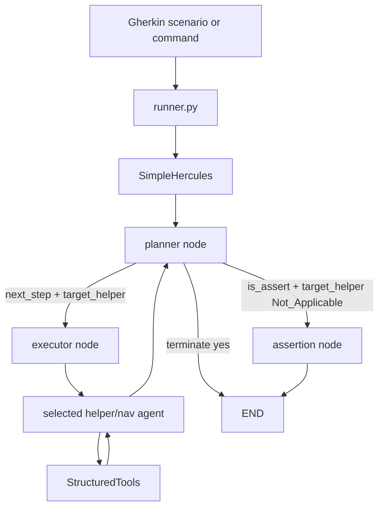

# Hercules LangGraph Architecture

This document describes the current LangGraph runtime contract for Hercules.
The public interface remains Gherkin in and reports out, but orchestration now
lives in `SimpleHercules` instead of the older conversational AG2 group-chat
loop.

## Runtime Overview

`runner.py` sends each scenario or command to `SimpleHercules`. `SimpleHercules`
builds a LangGraph `StateGraph` with three nodes:

- `planner`
- `executor`
- `assertion`



The graph starts at `planner`. The planner either schedules work for
`executor`, routes an assertion verdict to `assertion`, or terminates the graph.
After each executor turn, control always returns to the planner.

## Planner JSON Contract

The planner returns strict JSON. The fields consumed by `AgentState` are:

```json
{
  "plan": "Open the demo store and search for a product.",
  "next_step": "Navigate to the demo store and search for wireless headphones.",
  "target_helper": "browser",
  "terminate": "no",
  "final_response": "",
  "is_assert": false,
  "assert_summary": "",
  "is_passed": false
}
```

`is_passed` is always treated as a boolean. Use `false` while work is still in
progress, and only use `true` when the planner is making a final passing
assertion.

The assertion contract is:

- `is_assert=true`, `target_helper="Not_Applicable"`, and `terminate="no"`
  routes to the assertion node.
- The assertion node trusts the planner's `is_passed` and `assert_summary`.
- `terminate="yes"` ends the graph directly and publishes `final_response`.
- Missing or falsey `is_passed` is treated as `false`.

Repeated planner steps are tracked by normalized `next_step` signatures. When a
planner repeats a previously completed step, Hercules logs a
`PLANNER_REPEAT_NOTICE` and allows execution to continue; a repeat is not
silently converted into success.

If the planner exceeds `planner_max_chat_round`, the graph returns a failed
assertion-style result with `is_passed=false` and an explicit max-round summary.
Planner LLM timeouts also become failed assertion-style results.

## Helper Routing

The planner's `target_helper` selects a runtime helper:

| Planner `target_helper` | Runtime helper |
| --- | --- |
| `browser` | `browser_nav_agent` |
| `api` | `api_nav_agent` |
| `sec` | `sec_nav_agent` |
| `sql` | `sql_nav_agent` |
| `time_keeper` | `time_keeper_nav_agent` |
| `mcp` | `mcp_nav_agent` |
| `executor` | `executor_nav_agent` |
| `agent` | `browser_nav_agent` |

Unknown helpers fall back to `browser_nav_agent`.

Before invoking a helper, `SimpleHercules` builds the helper task from the
planner's `next_step` plus runtime context:

- For browser helpers, it refreshes the live browser URL from
  `PlaywrightManager` and prefers that value over stale state.
- It appends `Current Page: <url>` to browser helper tasks when a URL is known.
- If dynamic long-term memory is enabled, it queries memory for the concrete
  helper task and injects `EXTRA INFORMATION` for that helper step.

Memory is also written when a helper response includes
`##FLAG::SAVE_IN_MEM##`.

## Navigation Agent Loop

`SimpleHercules._run_nav_agent()` owns the helper execution loop:

1. Await helper readiness via `ensure_tools_ready()` when the helper provides
   it. This is important for MCP, where server connections and tool discovery
   are asynchronous.
2. Bind the helper's LangChain `StructuredTool` list to the helper LLM.
3. Invoke the helper LLM with system message plus helper task.
4. Execute returned tool calls and append `ToolMessage` results.
5. Continue until the helper emits `##TERMINATE TASK##`, emits no tool calls,
   or reaches `browser_nav_max_chat_round`.

If `bind_tools()` fails, Hercules falls back to a bare LLM call. If a context
limit error is detected, message history is compressed and the LLM call is
retried.

When max nav rounds are reached, the helper returns an explicit error:

```text
[ERROR] <agent> max nav rounds (<n>) reached before ##TERMINATE TASK##. Last assistant response: ...
```

This prevents tool-call-only loops from being mistaken for success.

## Browser State Guard

Browser tool calls can change the DOM, URL, or page state. To avoid executing
later tool calls against stale DOM data, the executor has a browser-only guard.

If a browser helper tool result indicates state changed, or if the executed
tool is a known state-changing browser action and did not error, Hercules:

- stops executing the remaining tool calls from that assistant message
- records only the tool calls that actually ran in conversation history
- appends a message telling the helper how many calls were skipped
- instructs the helper to re-read the current page/DOM before continuing

State-changing browser tools include `open_url`, `click`, `bulk_enter_text`,
`bulk_select_option`, `bulk_set_date_time_value`, `bulk_set_slider`,
`click_and_upload_file`, `drag_and_drop`, `entertext`, `hover`,
`press_key_combination`, and `set_current_geo_location`.

This guard is one of the migration-critical safety behaviors: a model may
return multiple tool calls in one response, but Hercules must not blindly run
read or write calls that were planned against a pre-action DOM snapshot.

## Tool Registration and Schema Rules

Hercules tools are normal Python functions registered with the local
`@tool(...)` decorator. Runtime conversion flows through
`testzeus_hercules/utils/langchain_tools.py`:


Tool schemas must stay compatible with strict OpenAI-compatible providers and
Vertex/Gemini-style tool schemas.

Use:

- scalar parameters such as `str`, `int`, `float`, and `bool`
- `List[Dict[str, str]]` for bulk browser actions
- explicit empty schemas for no-argument tools

Avoid:

- tuple public inputs
- generated `prefixItems`
- malformed list schemas such as `items: {}`
- wrapper-only top-level `kwargs`
- stale browser argument names such as `selector_text_list`

## Browser Tool and DOM Format

Hercules injects an `md` attribute into DOM elements and uses it as the primary
selector reference.

Single click:

```json
{
  "selector": "button[md='new-account']",
  "type_of_click": "click"
}
```

Bulk text entry:

```json
{
  "entries": [
    {
      "selector": "input[md='account-name']",
      "text_to_enter": "Acme"
    }
  ]
}
```

Current sensing tools return compact payloads:

- `get_interactive_elements`: interactive accessibility nodes
- `get_input_fields`: form/input nodes
- `get_page_text`: cleaned visible text
- `geturl`: current page URL

Do not document full raw DOM dumps as the default output. Large or deeply
nested DOM payloads can cause provider-side `INVALID_ARGUMENT` or token-limit
errors on complex pages.

## MCP Runtime

MCP is integrated through the MCP navigation helper and `MCPHelper`.

Important runtime semantics:

- `SimpleHercules` awaits `ensure_tools_ready()` before running a helper loop.
  For the MCP helper, this gives MCP connections and tool registration time to
  complete before the LLM binds tools.
- `MCPHelper.initialize_mcp_connections()` connects configured servers over
  `stdio`, `sse`, or `streamable-http`.
- For each discovered server tool, Hercules creates a dynamic LangChain
  `StructuredTool` named `mmcp_<server>_<tool>`.
- The wrapper preserves the MCP server tool's input schema as the
  `StructuredTool` argument schema, instead of flattening everything into an
  untyped `kwargs` parameter.
- MCP sessions, client contexts, and HTTP clients are cleaned up during
  shutdown via `MCPHelper.destroy()`.

The branch also exposes Hercules itself as an MCP server:

```bash
testzeus-hercules-mcp
```

That entrypoint starts a FastMCP server using streamable HTTP. By default it
serves `http://0.0.0.0:8000/mcp` and exposes tools such as
`generate_gherkin`, `run_test`, and `get_test_results`.

## Token and Cost Accounting

Planner and navigation helper LLM calls contribute to LangGraph token totals.
`SimpleHercules` records per-step entries in `step_token_log` and accumulates:

- `total_prompt_tokens`
- `total_completion_tokens`
- `total_cost` when providers expose cost metadata
- `step_timings`
- `total_steps`

Navigation agent token usage is collected per helper LLM turn and then rolled
into the executor step entry. Final reporting returns:

```json
{
  "usage_including_cached_inference": {
    "langgraph": {
      "prompt_tokens": 7,
      "completion_tokens": 11,
      "total_tokens": 18,
      "cost_unavailable": true
    },
    "cost_unavailable": true
  }
}
```

When no provider response includes cost metadata, Hercules sets
`cost_unavailable=true`. This is expected for providers or gateways that return
tokens but not price data.

## LLM Config Buckets

New setup should use `agents_llm_config.json` plus an active provider/profile
key selected by `AGENTS_LLM_CONFIG_FILE_REF_KEY`.

```json
{
  "litellm": {
    "planner_agent": {},
    "nav_agent": {},
    "mem_agent": {},
    "helper_agent": {}
  }
}
```

- `planner_agent`: planner node model
- `nav_agent`: shared by browser, API, security, SQL, time keeper, MCP, and
  executor helpers
- `mem_agent`: dynamic long-term memory model
- `helper_agent`: visual/multimodal helper model

The planner model should be strong at structured JSON. Navigation models must
support tool calling.

Direct `LLM_MODEL_*` environment variables and direct `--llm-model*` CLI flags
are legacy compatibility paths. The current config layer logs a deprecation
warning when direct `LLM_MODEL_*` configuration is used.
